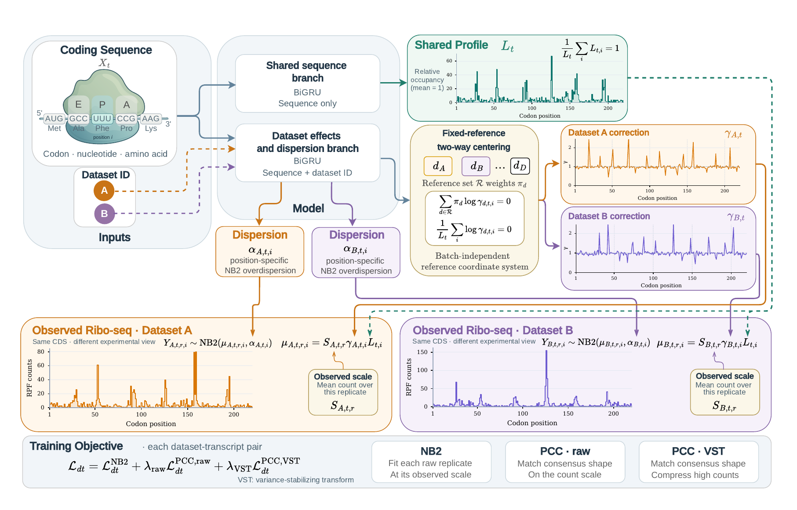
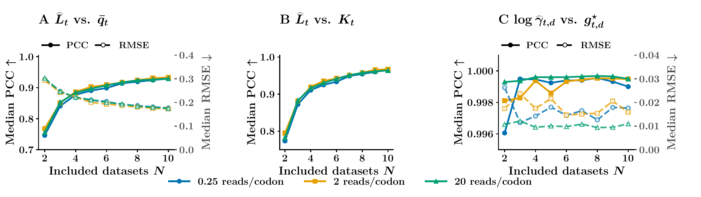
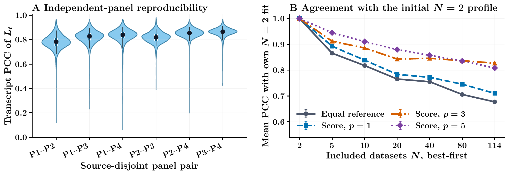

# RiboUnmix

**Learn a shared ribosome profile while accounting for dataset-specific effects.**

Ribosome profiling experiments can give different signals for the same coding
sequence. RiboUnmix models those observations with a shared, sequence-based
profile and a positive correction for each dataset. It is a research framework
built with PyTorch, Lightning, and Hydra.

[Model overview](#model-overview) ·
[Try the notebook](notebooks/01_model_checks_and_predictions.ipynb) ·
[Run the synthetic smoke experiment](examples/synthetic_smoke/README.md) ·
[Training configuration](config/config_ribounmix_multidataset.yaml)

## Model overview

<p align="center">
  <a href="assets/ribounmix_architecture.pdf">
    
  </a>
</p>

The sequence-only branch produces a positive, mean-one shared profile
`L_bio`. A separate branch combines sequence with dataset identity to estimate
the multiplicative correction `gamma` and position-specific NB2 dispersion.
Fixed-reference centering defines the coordinate system of the decomposition;
the observed replicate mean supplies count scale. Raw replicates supervise the
NB2 likelihood, while their arithmetic consensus supplies auxiliary shape
objectives. [Open the vector figure.](assets/ribounmix_architecture.pdf)

## Start here

| You want to… | Start with… | What you need |
|---|---|---|
| Train, validate, and replay a checkpoint | [Synthetic smoke experiment](examples/synthetic_smoke/README.md) | CPU, bundled data and checkpoint |
| Understand the model and check that it runs | [CPU notebook](notebooks/01_model_checks_and_predictions.ipynb) | Python environment; no external data or checkpoint |
| Inspect a trained prediction | Optional prediction section of the notebook | A saved prediction Parquet file |
| Train across Ribo-seq datasets | `main_ribounmix_multidataset.py` | Prepared sequence and replica-profile tables |
| Train a single-organism benchmark | `main_ribounmix_benchmarking.py` | The corresponding CDS and weighted profile tables |

## Run the reviewer smoke experiment

The repository includes a deterministic two-dataset synthetic fixture, a
reduced but otherwise production-path model, a selected validation checkpoint,
and its prediction export. After installing the environment:

```bash
# Check hashes, checkpoint tensors, predictions, normalization, and centering.
python examples/synthetic_smoke/run.py verify

# Replay validation inference from the committed checkpoint.
python examples/synthetic_smoke/run.py replay

# Train for two epochs from a fresh initialization and export validation rows.
python examples/synthetic_smoke/run.py train
```

The fixture is an integration test, not a reported scientific experiment or a
general pretrained model. See its [provenance and limitations](examples/synthetic_smoke/README.md).

## Try the notebook on your laptop

The core notebook uses a small instance of the real model and generated inputs.
It checks normalization, masking, reference centering, target scaling, and finite
gradients. Its random-weight predictions are explicitly labeled; they are not
evidence of trained performance.

Python **3.12** is the environment used for the checks in this checkout.
From a complete source checkout:

```bash
git clone https://github.com/GabMartino/RiboUnmix.git
cd RiboUnmix
python3.12 -m venv .venv
source .venv/bin/activate
python -m pip install --upgrade pip

# CPU build for the walkthrough. For GPU training, choose the matching wheel.
python -m pip install torch==2.10.0 --index-url https://download.pytorch.org/whl/cpu
python -m pip install -r requirements-notebooks.txt
python -m ipykernel install --sys-prefix --name ribounmix --display-name "Python 3 (RiboUnmix)"
jupyter lab notebooks/01_model_checks_and_predictions.ipynb
```

Select **Python 3 (RiboUnmix)**, then **Restart Kernel → Run All**. For saved
results, set `PREDICTION_PATH` or `ABLATION_TABLE_DIR` near the top of the notebook.
The default run skips those optional sections.

For CUDA or ROCm, use the appropriate build from the
[PyTorch installation guide](https://pytorch.org/get-started/locally/), keeping
the project version pinned. Jupyter's installation options are documented
[here](https://jupyter.org/install). Training without notebook tools needs only
`requirements.txt`.

## What is being learned?

For transcript `t`, dataset `d`, and valid codon `i`:

| Quantity | Meaning |
|---|---|
| `L_bio[t, i]` | Positive shared profile from sequence; normalized to mean one |
| `gamma[d, t, i]` | Positive dataset-conditioned multiplicative correction |
| `S[d, t]` | Mean of the **observed target** over valid positions |
| `alpha[d, t, i]` | NB2 dispersion; variance is `mu + alpha * mu²` |

The two branches have independent recurrent encoders. The dataset branch uses
sequence, dataset identity, and position; it does not consume `L_bio`.

```text
shape = gamma * L_bio

mass_conservation = true:   mu = S * shape / mean_valid(shape)
mass_conservation = false:  mu = S * shape
```

Fixed-reference centering anchors log-gamma to a specified dataset panel and
removes its positional constant when the configured centering conditions hold.
The choice of reference panel and weights is part of the model definition.
`log_sigma` in existing exports is the historical name for **log(alpha)**.

**Interpretation matters.** `L_bio` is shared by construction; that does not prove
that it is purely biological. Dataset-specific biology and technical effects can
both enter `gamma`. The bounded transform `rho = L_bio / (1 + L_bio)` is a
diagnostic representation, not a validated physical occupancy measurement.
Because `mu` uses observed target scale, it is not an absolute-abundance
prediction from sequence alone.

## Train with your data

Full experiments require local data assets. The complete real and synthetic
training collections are intentionally excluded from `Datasets/data/`; only the
small, explicitly documented reviewer fixture and its smoke checkpoint are
committed.

- **Multiple datasets:** register profile Parquets in
  `config/dataset_config/` and set `paths.sequences_path`. Profiles include
  `ribo_cds_replicas` with shape `[replicas, codons]`. Dataset IDs must agree with
  the configured encoding and checkpoint reference panel.
- **Benchmarks:** see [benchmark preprocessing](Datasets/benchmarking_data/README.md)
  for the weighted profiles and aligned CDS files.
- **Splits:** multidataset defaults use a common validation panel. Those
  validation predictions are not an independent test set. Benchmark defaults
  use transcript-level train/validation/test partitions.

Inspect the resolved configuration before launching a run; this command does
not train or load the datasets:

```bash
python main_ribounmix_multidataset.py --cfg job --resolve
```

With the required assets available:

```bash
# Joint training on the datasets selected in the configuration.
python main_ribounmix_multidataset.py

# One independent organism benchmark.
python main_ribounmix_benchmarking.py experiment.dataset=human_iwasaki_2014

# Synthetic experiment using its own configuration and dataset mapping.
python main_ribounmix_synthetic.py
```

The full configurations default to GPU execution. For a small CPU debugging run,
set `trainer.accelerator=cpu trainer.devices=1 trainer.precision=32-true
data.num_workers=0`; the data requirements still apply.

Training and prediction write under `checkpoints/`, `logs/`, and `results/`.
Keep the resolved configuration, transcript split, reference panel, and
checkpoint-selection metadata together with each result. Changing these can
change the scientific comparison even when the model class is unchanged.

### Configurations are different experiments

| Setting | Real-data default | Benchmark default | Synthetic default |
|---|---|---|---|
| Mass conservation | Enabled | Disabled | Disabled |
| Gamma reference | Fixed panel | Batch-grouped; singleton fallback | Fixed panel |
| NB formulation | Standard NB2 | Mean-gradient reweighted NB2 | Standard NB2 |
| Sample reduction | Transcript balanced | Global weighted | Transcript balanced |

The loss combines raw-replica NB2 with raw and NB-VST correlation terms on the
replica consensus; their coefficients and the gamma penalty are configurable.
Use each run's frozen config to describe its objective. One observed profile
stored as one replica does not establish a benefit from biological replication.

## Selected manuscript results

These panels provide scientific context for the software; the lightweight
repository does not include the complete manuscript result trees or their
analysis pipeline, and the bundled smoke experiment does not reproduce them.

### Controlled synthetic recovery

<p align="center">
  <a href="assets/synthetic_recovery.pdf">
    
  </a>
</p>

Across cumulative panels of 2--10 simulated datasets and three nominal read
depths, the figure compares the fitted shared profile with the simulated
two-trajectory occupancy consensus (A), with the upstream programmed
kinetic profile (B), and the fitted log-corrections with the identifiable
centered injected effects (C). PCC and RMSE quantify different properties and
use separately labelled axes. These estimates are conditional on seed-42,
best-validation-loss fits; they are not uncertainty over training seeds.
[Open the vector figure.](assets/synthetic_recovery.pdf)

### Reproducibility on heterogeneous real data

<p align="center">
  <a href="assets/real_data_stability.pdf">
    
  </a>
</p>

Panel A compares transcript-level shared profiles across four source-family-
disjoint HEK Ribo-seq collections. Panel B follows agreement with each
reference policy's own initial `N = 2` fit as datasets are added along a nested
best-first path. Cross-panel agreement supports reproducibility under the
model, whereas cumulative agreement measures reference sensitivity; neither
establishes biological correctness. All displayed fits use training seed 42.
[Open the vector figure.](assets/real_data_stability.pdf)

## Verify the public package

The bundled verifier checks fixture and checkpoint hashes, finite tensors,
positive predictions, shared-profile normalization, and gamma-centering
constraints:

```bash
python examples/synthetic_smoke/run.py verify
python examples/synthetic_smoke/run.py replay
```

## Project map

```text
notebooks/                        Interactive model checks and prediction inspection
assets/                           Web previews and vector manuscript figures
examples/synthetic_smoke/         Runnable data, checkpoint, replay, and verifier
Models/RiboUnmixModel/            Shared and dataset-conditioned branches
Models/RiboUnmixLightningModule.py Losses, training steps, and prediction export
Dataloaders/RiboUnmix*/           Data loading, masks, replicas, and grouped batches
config/                          Runnable model and dataset configurations
Datasets/                        Preprocessing source and local data assets
```

The public package uses the **RiboUnmix** names throughout. Historical run
orchestration and manuscript-specific analysis code are intentionally omitted.

## Research status

This is evolving research code. The repository currently has no license file
or finalized citation metadata. Do not infer article-scale performance from
the bundled smoke fixture; use the frozen configurations and authoritative
experiment artifacts associated with the manuscript.
